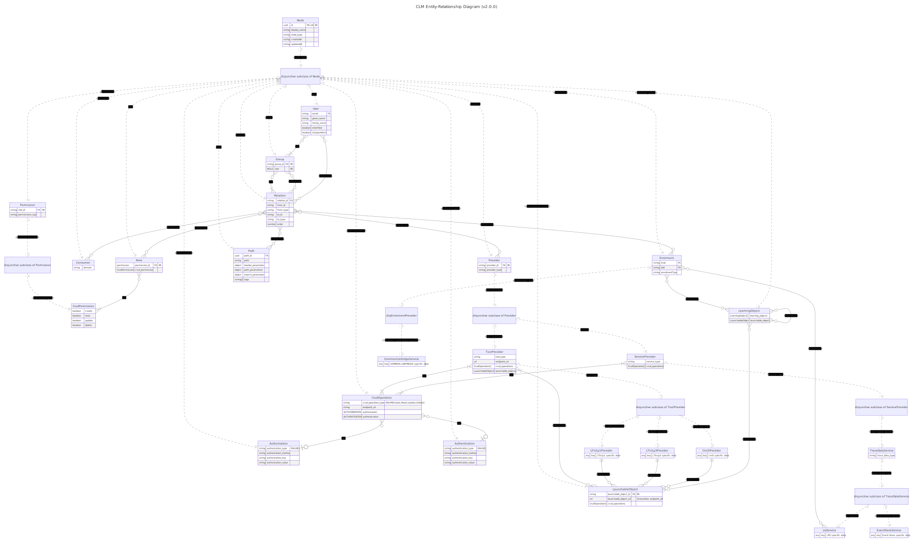

**This microservice is based upon  [clm-core](https://github.com/fraunhoferfokus/clm-core) and extends the basic functionalities with additional features**

## CLM-EXT-TOOLS
This service facilitates the management of Launchable Tools. Launchable Tools are those that are made available by CLM providers through supported standards. Currently, the standards supported are LTI 1.1, LTI 1.3, and CMI5. A Launchable Tool is never assigned directly to a learner or a group; instead, it is always associated within the context of a Learning Object.

## Requirements
- MariaDB, set up locally. This service leverages a database (DB) as the cornerstone for storing documents persistently. To establish a connection with MariaDB, it is essential that the database is secured through username and password authentication. Therefore, in order to run this service it is  required to create a database within the MariaDB and configure it with a username and password for access control
  * MariaDB Installation: https://mariadb.com/kb/en/getting-installing-and-upgrading-mariadb/
  * For setting up the password of a user: https://mariadb.com/kb/en/set-password/
  
- Node.js 20.x: https://nodejs.org/en/download

### Folder Structure
root

├── api-docs # Open API 3.0.0 definition as .yaml file documenting all routes and data models this service offers.

├── docs # Developer documentation of all functions, classes, interfaces, types this service exposes as an npm package.

├── dist # The built TypeScript project transpiled to JavaScript.

└── src # Business-relevant logic for this web server.

### Architecture


The Entity Relationship Model of the Open Core is shown above.

This service defines its own resources as well as serving resources that originate from other modules. 

#### LearningObjects ([clm-ext-learning_objects](https://github.com/fraunhoferfokus/clm-ext-learning_objects))
- Necessary for associating or removing a launchable object with a tool.

#### ServiceProviders ([clm-ext-service_providers](https://github.com/fraunhoferfokus/clm-ext-service_providers))
- Required for associating or removing a launchable object with a service provider.


This service functions as a web microservice that can be orchestrated through a gateway and as an npm package to provide functionalities to other CLM extensions. A microservice can build upon the classes/types/interfaces of this service to extend basic functionalities.

## Setup for testing the webserver 
1. The service's configuration can be customized by referring to the `.env` file. Within this file, the `MARIA_CONFIG` variable should be updated with the appropriate values to reflect the user's specific database settings. Refer to the `MARIA_CONFIG` variable in the table below to see which comma seperated value refers to which respective database setting. 
2. npm install
3. Copy .env.default to .env and overwrite needed properties

Following table gives an overview of the settings you can change through the environment variables

| Name                 | Example                                                                         | Required (Yes/No) | Description                                                                                                                           |
| -------------------- | ------------------------------------------------------------------------------- | ----------------- | ------------------------------------------------------------------------------------------------------------------------------------- |
| PORT                 | 3003                                                                            | Yes               | The port on which the service should be deployed.                                                                                     |
| DEPLOY_URL           | HOST_PROTOCOL://HOST_ADDRESS:GATEWAY_PORT/api                                   | Yes               | The address where all microservices are to be orchestrated. A /api must be appended.                                                  |
| MARIA_CONFIG         | MARIA_HOST_ADDRESS\|MARIA_PORT\|MARIA_DATABASE\|MARIA_USER\|MARIA_USER_PASSWORD | Yes               | A comma-separated string that must contain the configured parameters that were previously defined during the installation of MariaDB. |
| TOKEN_SECRET         | secret                                                                          | Yes               | to sign and verify JWTs for authentication. Have to be the same across all modules of the Open-Core                                   |
| DISABLE_ERR_RESPONSE | true                                                                            | No                | Flag to control whether error responses should be returned. Defaults to example value if not set.                                     |


3.1 `npm run dev` for development with nodemon
3.2 `npm start` for deployment

4.  Subsequently, the JSON representation of the Open-API specification should be accessible at:

`http://localhost:${PORT}/tools/swagger`

**To access the API endpoints detailed in the Open-API specification, an API token is required. This token is generated during the initialization of the clm-core module. For further details, please consult the documentation at [clm-core](https://github.com/fraunhoferfokus/clm-core).**
## For Consumption as an NPM Package

- Documentation about all exposed modules can be found under `/docs`.
- Include the package in your project's `package.json` dependencies:

    ```json
    "dependencies": {
        "clm-ext-tool": "git+https://$token:$token@$url_of_package#$branch_name"
    }
    ```

- To use database-dependent DAOs/DTOs, inject `MARIA_CONFIG` into the environment before importing the module:

    a) Manually in the code:

    ```javascript
    process.env.MARIA_CONFIG = "localhost|3306|clm|root|12345";
    import * as core from 'clm-ext-tool';
    ```

    b) Through `.env` file:

    ```.env
    MARIA_CONFIG=localhost|3306|clm|root|12345
    ```

    ```javascript
    import * as core from 'clm-ext-tool';
    ```


# Swagger Documentation

- Accessible routes for this microservice are available at `http://localhost:PORT/tools/swagger` after starting the service.
- Ensure to set up a reverse proxy to route traffic to the respective microservices as shown in the table.

### Changelog

The changelog can be found in the [CHANGELOG.md](CHANGELOG.md) file.

## Get in touch with a developer

Please see the file [AUTHORS.md](AUTHORS.md) to get in touch with the authors of this project.
We will be happy to answer your questions at {clm@fokus.fraunhofer.de}

## License

The project is made available under the license in the file [license.txt](LICENSE.txt)

